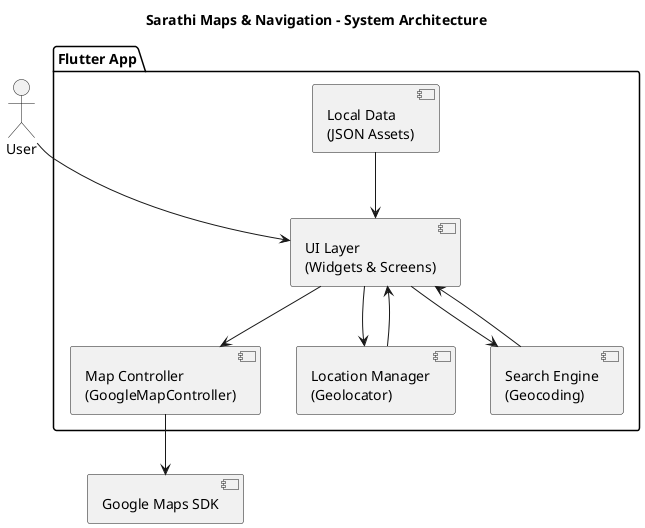
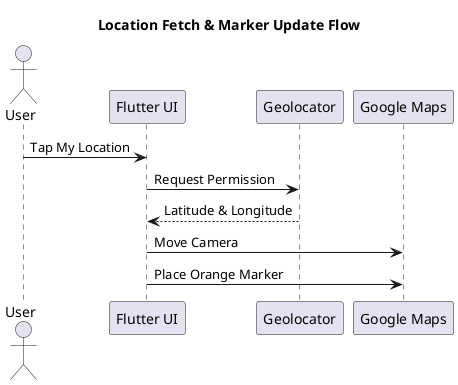

**🗺️ Sarathi Maps & Navigation** 

---

# 🚗 Sarathi Maps & Navigation

<p align="center">
  
  
  
  
  
</p>

---

## 📌 About the Project

**Sarathi Maps & Navigation** is a Flutter-based cross-platform mobile application that provides real-time location tracking, place search, custom markers, and interactive map visualization using the Google Maps SDK. The app delivers a smooth, Google Maps–like user experience with clean UI and animated camera movements.

---

## ✨ Features

* 🗺 **Google Maps Integration**
  Interactive map with zoom, tilt, bearing, and smooth camera animations.

* 📍 **Current Location Tracking**
  Displays the user’s current position with an **orange active marker**, similar to Google Maps.

* 🔍 **Search Location by Name**
  Search any city, area, or place and instantly navigate to it.

* 🟠 **Single Active Location Marker**
  Ensures only one orange marker is visible at a time (search or current location).

* 🟢 **Custom Static Markers**
  Loads predefined markers from local JSON assets.

* 🌗 **Dark & Light Map Themes**
  Toggle map styles for better visibility and accessibility.

* 🎯 **Smooth Camera Animations**
  Polished transitions for a professional navigation experience.

* 📱 **Cross-Platform Support**
  Works seamlessly on **Android** and **iOS** using a single Flutter codebase.

* 🔐 **Runtime Location Permission Handling**
  Handles location permissions correctly following platform guidelines.

* 🧩 **Modular & Scalable Architecture**
  Clean separation of UI, location services, and data layers.

---

## 📸 Screenshots

> 📌 Store screenshots inside a `screenshots/` folder.

```text
screenshots/
├── home_light.png
├── home_dark.png
├── search_location.png
├── my_location.png
```

| Light Mode                           | Dark Mode                          |
| ------------------------------------ | ---------------------------------- |
|  |  |

| Search Location                            | My Location                              |
| ------------------------------------------ | ---------------------------------------- |
|  |  |

---

## 🏗 System Architecture

### 📐 High-Level Architecture (PlantUML)



---

### 🔄 Location Flow Diagram (PlantUML)



---

## 🧰 Tech Stack

| Layer     | Technology              |
| --------- | ----------------------- |
| Language  | Dart                    |
| Framework | Flutter                 |
| Maps      | Google Maps Flutter SDK |
| Location  | Geolocator              |
| Search    | Geocoding               |
| UI        | Material 3              |
| Platforms | Android, iOS            |

---

## 📂 Project Structure

```text
sarathi/
├── android/
├── ios/
├── lib/
│   ├── main.dart
│   └── src/locations.dart
├── assets/
│   └── locations.json
├── screenshots/
├── pubspec.yaml
└── README.md
```

---

## ⚙️ Setup & Run

```bash
flutter pub get
flutter run
```

---

## 🍎 iOS Permission Configuration

Add the following to `ios/Runner/Info.plist`:

```xml
<key>NSLocationWhenInUseUsageDescription</key>
<string>Sarathi needs your location to show your position on the map.</string>
```

---

## ⚠️ Simulator Note

* iOS Simulator uses **simulated GPS**
* Set correct location via:
  `Features → Location → Custom Location`

---

## 🚀 Future Enhancements

* 🛣 Turn-by-turn navigation with polylines
* 📏 Distance and ETA calculation
* 🔵 Google Maps blue dot with accuracy radius
* 🔍 Places autocomplete
* 📶 Offline map support

---


